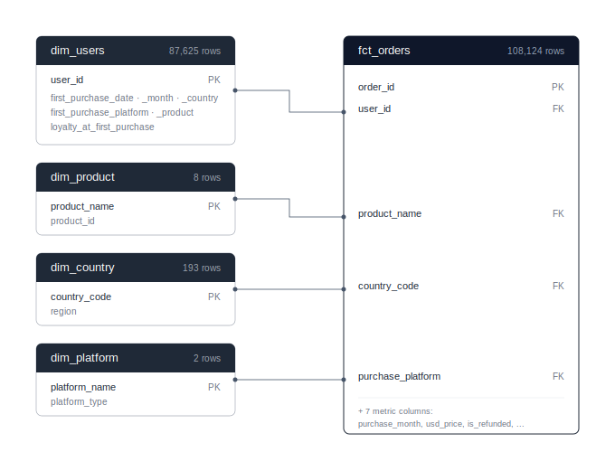
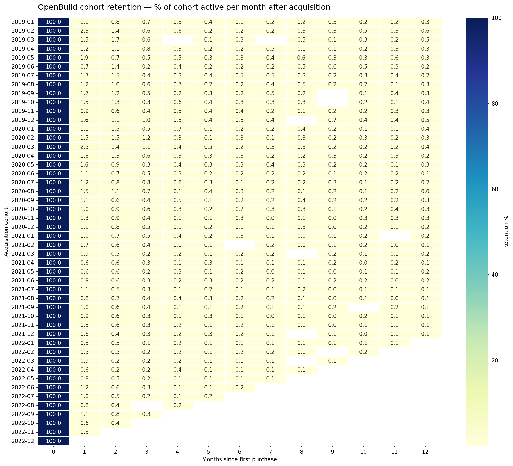
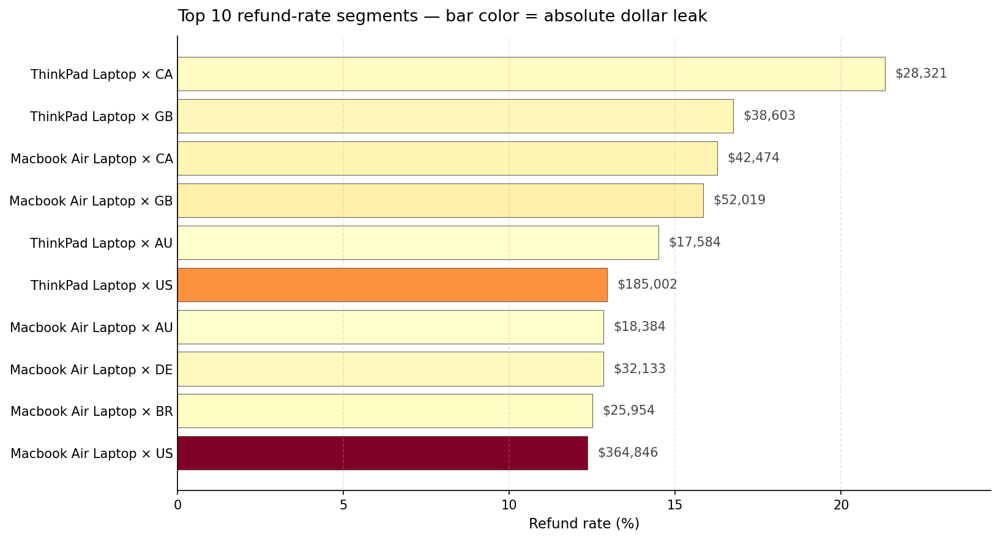
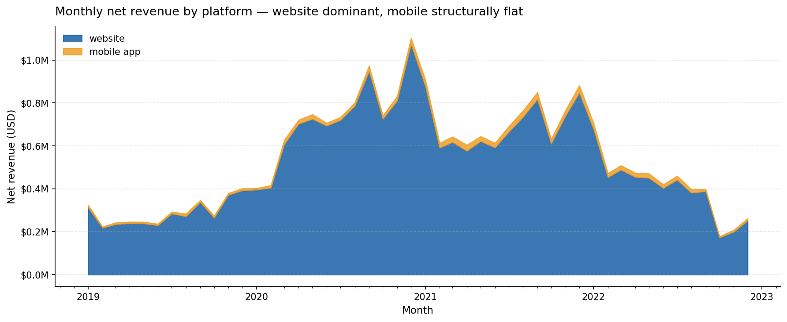

# OpenBuild Analytics Engineering

End-to-end analytics layer for a mid-size electronics retailer.
Medallion architecture · star schema · 28 tested transformations.

[**📄 Executive 1-pager (PDF)**](docs/openbuild_findings_one_pager.pdf) — methodology in Appendix A1–A3

---

## Numbers at a glance

| | |
|---|---|
| **Scope** | 108,124 orders · 87,625 users · 193 countries · Jan 2019 – Dec 2022 |
| **Models** | 2 silver · 4 dimensions · 1 fact · 3 analytical marts |
| **Tests** | 28 assertions across schema, uniqueness, referential integrity, and derived-column invariants — all passing |
| **Findings** | Retention 0.8%–1.4% month-1 across 48 cohorts · refund baseline 4.97% (laptops 12-21%) · website 96.8% of revenue |

---

## The Problem

OpenBuild's leadership needs reliable answers to three questions:
which cohorts come back, where refunds erode margin,
and which platform deserves the next investment dollar.
Raw transactional data — 108K orders across 87K users, four years, 193 countries —
cannot answer them directly. The gap is a modeled, tested data layer.

## The Architecture

Three-layer medallion model. Each layer has a single job.

| Layer | Purpose | Contents |
|---|---|---|
| **Bronze** (raw) | Immutable source of truth | `orders_raw`, `country_lookup_raw` |
| **Silver** (staging) | Type enforcement, deduplication, null handling | `stg_orders`, `stg_country_lookup` |
| **Gold** (marts) | Business semantics, dimensional model | `dim_users`, `dim_product`, `dim_country`, `dim_platform`, `fct_orders`, three analytical marts |

Raw is never edited. Silver is rebuilt on every run. Gold is what stakeholders consume.



## The Model

Star schema. One fact, four dimensions, three derived marts.
Grain: one row per order. The same model answers cohort, refund, and channel questions without rework.

- `dim_users` — one row per user; attributes locked at acquisition time (87,625 rows)
- `dim_product` — one row per product (8 rows)
- `dim_country` — one row per country with regional rollup (193 rows)
- `dim_platform` — one row per purchase platform with category rollup (2 rows)
- `fct_orders` — one row per order; foreign keys to all four dimensions; cohort enrichment computed once (108,124 rows)
- `mart_cohort_retention` — monthly retention matrix (cohort × months_since_acquisition)
- `mart_refund_metrics` — refund rate and revenue leak by product × country
- `mart_channel_revenue` — monthly orders and revenue by purchase platform



## The Findings

Three executive-grade findings backed by the SQL marts above. Each cause is labeled `tested` (validated in this analysis), `partially tested` (directional evidence), or `hypothesis` (plausible but requires further data).

### Finding 1 — Retention is structurally flat, not strategically broken

**Result.** Month-1 retention sits between **0.8% and 1.4% across all 48 cohorts** (Jan 2019 – Dec 2022). No cohort breaks the band — including those acquired during the COVID-era acquisition peak (Jun 2020 = 2,887 new users).

**Implication.** Marketing initiatives aimed at retention will not move the needle. The lever is product mix.

| Cause | Weight | Status |
|---|---|---|
| Durable goods naturally have low repurchase frequency (1.23 orders/user across 4 years) | High | `tested` |
| Catalog skews toward one-time purchases vs. replenishables (only 1 of 8 products is replenishable) | High | `tested` |
| Limited cross-sell mechanics in checkout | Medium | `hypothesis` |

*Source: `mart_cohort_retention`, `dim_users`, `fct_orders`. Methodology: Appendix A1.*


*Cohort × month-since-acquisition. Color intensity = % of cohort active. Read vertically: month-1 retention is structurally flat at ~1% across all 48 cohorts.*

---

### Finding 2 — Laptops drive 2.5–4.3× the company refund rate

**Result.** Refund baseline = **4.97%** of all orders. Laptops dominate the top-10 worst segments — every single one is a laptop. Worst: ThinkPad × CA at **21.3%** (4.3× baseline). Largest dollar leak: MacBook Air × US at **$365,000** refunded (12.4% rate × high volume).

**Implication.** Refund-reduction initiatives should target laptops first. Geographic variation (ThinkPad: CA 21.3% vs. US 12.9% = 8.4 pp gap) suggests fulfillment or returns-policy investigation by country.

| Cause | Weight | Status |
|---|---|---|
| High-AOV products carry higher absolute return risk | High | `tested` |
| Spec / expectation mismatch in laptops vs. accessories | High | `partially tested` |
| Country-level returns policy or fulfillment variance | Medium | `partially tested` |
| Localization issues (pricing, positioning) | Medium | `hypothesis` |

*Source: `mart_refund_metrics`, `fct_orders`, `dim_country`. Methodology: Appendix A2.*


*Top 10 product × country refund rates (segments with ≥100 orders). Bar length = rate. Bar color = absolute dollar leak. Laptops dominate; MacBook Air × US combines high rate with high volume.*

---

### Finding 3 — Mobile is structurally a low-AOV channel

**Result.** Website = **96.8% of lifetime revenue** ($25.0M of $25.9M). Mobile generates **17.1% of orders (18,517 of 108,124) but only 3.2% of revenue ($832K)** — implying mobile AOV is roughly 5× lower than web AOV. The mix has been stable: mobile share moved from 2.95% (2019) to 3.93% (2022) over 48 months.

**Implication.** Mobile investment thesis must target AOV, not order volume. At current AOV, doubling mobile order volume only adds ~3 percentage points to total revenue.

| Cause | Weight | Status |
|---|---|---|
| Mobile users skew toward accessory purchases | High | `tested` |
| Catalog product mix is desktop-shaped (laptops, monitors) | High | `tested` |
| Mobile UX friction at high-value checkout | Medium | `hypothesis` |
| Desktop preference for large / considered purchases | Low–Medium | `hypothesis` |

*Source: `mart_channel_revenue`, `fct_orders`, `dim_platform`. Methodology: Appendix A3.*


*Monthly net revenue, website (blue) vs. mobile app (amber). The orange band's flat width across 4 years is the "structurally low-AOV" finding visualized.*

---

## Data Quality

Tests run on every model build. **28 assertions** all passing.

| Test type | Examples | Coverage |
|---|---|---|
| `not_null` | `dim_users.user_id`, `fct_orders.order_id`, `purchase_ts` | Schema integrity |
| `unique` | All four dimension primary keys; `fct_orders.order_id` | Primary key contracts |
| `relationships` | All four FKs from `fct_orders` to dimension tables | Referential integrity |
| `accepted_values` | `purchase_platform ∈ {website, mobile app}` | Domain constraints |
| `range` | `retention_pct ∈ [0, 100]` | Bounds checking |
| `invariants` | `refunded_revenue + net_revenue = gross_revenue`; monthly platform shares sum to 100 | Derivation correctness |

### Quality Decisions (audit trail)

- **3 orders (0.003%)** with unparseable purchase timestamps excluded from cohort assignment
- **2 columns** (`MARKETING_CHANNEL_cleaned`, `ACCOUNT_CREATION_METHOD_cleaned`) entirely null; excluded from model
- **`country_lookup_raw` had a duplicate primary key** for `US` (rows with regions `'x'` and `'North America'`); resolved at silver layer with deterministic deduplication, mapped to canonical `AMER` region
- **18 orders use `EU` or `AP` as country codes** (region-bloc identifiers entered as country codes — a contract violation in the source); preserved as `Unclassified` rows in `dim_country` to maintain referential integrity without losing the orders
- **26 source countries had NULL or junk regions** (`'x'`, NULL, etc.); mapped to `Unclassified` rather than dropped
- **4 orders roll up under NULL `country_code`** (missing geolocation); retained as a distinct segment so refund leakage from unknown-country orders remains visible
- **Raw `_RAW` columns retained** in bronze for audit lineage; gold uses cleaned versions only
- **Cohorts after Dec 2021** are right-censored; 12-month retention reported only for fully observable cohorts

## Reproducibility

Every number above is reproducible from this repository.

```bash
git clone https://github.com/joyce92200/ecommerce-analytics-engineering.git
cd ecommerce-analytics-engineering
python -m venv .venv && source .venv/Scripts/activate
pip install -r requirements.txt
jupyter notebook notebooks/01_cohort_exploration.ipynb
```

Run all cells top-to-bottom (`Kernel → Restart Kernel and Run All Cells`). The test cell at the bottom should report **28/28 passed**. Each finding corresponds to a specific notebook cell whose output matches the numbers in this README.

> Note: the raw Excel file is not committed to the repository (excluded via `.gitignore` to keep the repo lean). Place the source file at `data/raw/2026-04-21_elist_data_cleaned.xlsx` before running the notebook.

## The Stack

**Built:** DuckDB · pandas · Jupyter · SQL · Git
**Roadmap:** dbt Core migration · GitHub Actions CI · BI dashboard layer · SCD Type 2 on `dim_users` · forecasting module on platform revenue

## Repository

```text
.
├── data/
│   ├── raw/                          # Bronze · immutable source (.xlsx not committed)
│   ├── processed/                    # Silver · staging outputs
│   └── outputs/                      # Final analytical artifacts (charts, diagrams)
├── docs/
│   └── openbuild_findings_one_pager.pdf
├── notebooks/
│   └── 01_cohort_exploration.ipynb
├── sql/
│   ├── staging/
│   │   ├── stg_orders.sql
│   │   └── stg_country_lookup.sql
│   └── marts/
│       ├── dim_users.sql
│       ├── dim_product.sql
│       ├── dim_country.sql
│       ├── dim_platform.sql
│       ├── fct_orders.sql
│       ├── mart_cohort_retention.sql
│       ├── mart_refund_metrics.sql
│       └── mart_channel_revenue.sql
└── tests/
    └── test_models.sql               # 28 data-quality assertions
```

---

*Code in `/sql` and `/notebooks`. Data quality decisions in this README; full methodology in [`docs/openbuild_findings_one_pager.pdf`](docs/openbuild_findings_one_pager.pdf).*
