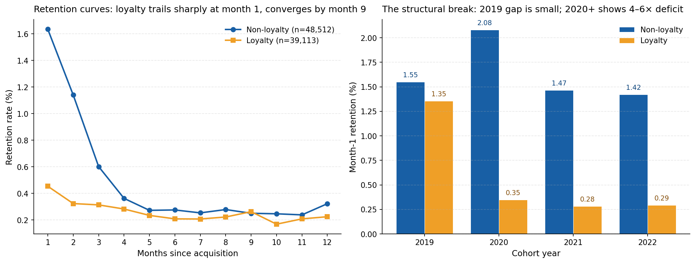
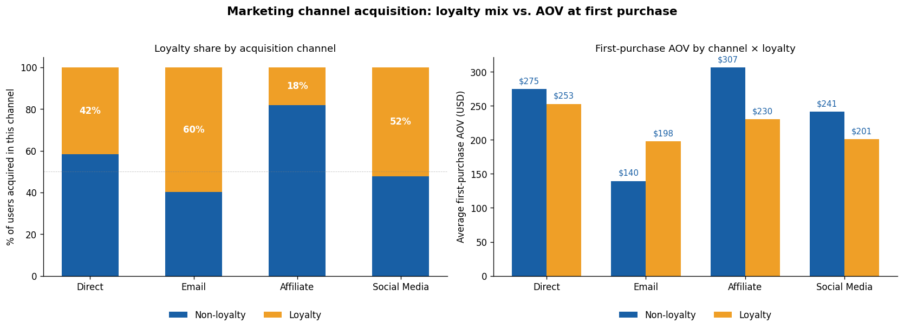
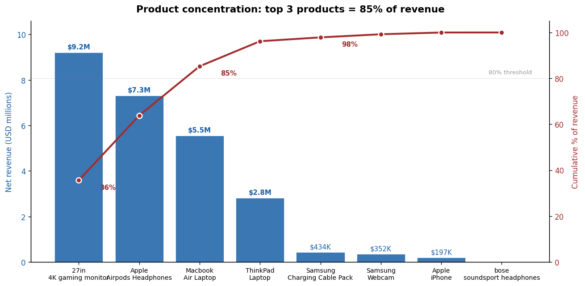

# OpenBuild Analytics Engineering

From a raw 108K-order Excel file to a tested star schema, a live dashboard, and four findings a CFO could act on tomorrow.
Medallion architecture · star schema · 37 passing tests.

[**🚀 Live dashboard**](https://openbuild-analytics.streamlit.app) · [**📄 SQL & Methodology Appendix (PDF)**](docs/openbuild_findings_one_pager.pdf)

---

## Numbers at a glance

| | |
|---|---|
| **Scope** | 108,124 orders · 87,625 users · 193 countries · Jan 2019 – Dec 2022 |
| **Models** | 2 silver · 4 dimensions · 1 fact · 6 analytical marts |
| **Tests** | 37 assertions across schema, uniqueness, referential integrity, and derived-column invariants — all passing |
| **Headline findings** | Loyalty's retention deficit traces to the email channel, not the program · refund baseline 4.97% (laptops 12–21%) · website 96.8% of revenue · top 3 products = 85% of revenue |

---

## Executive Summary

OpenBuild operates across 193 countries with 108K orders collected from 2019 to 2022. Leadership needs reliable answers to four operational questions: which acquisition channels deliver durable customers, where refunds erode margin, which platform deserves the next investment dollar, and how concentrated the catalog is. 

The pipeline turns a raw Excel export into a star schema with 37 passing tests, a live dashboard, and a one-page PDF for executives. Four findings come out of it. Each names a cause, weights the evidence, and ends in a decision someone can make on Monday.

---

## The Architecture

| Layer | Purpose | Contents |
|---|---|---|
| **Bronze** (raw) | Immutable source of truth | `orders_raw`, `country_lookup_raw` |
| **Silver** (staging) | Type enforcement, deduplication, null handling | `stg_orders`, `stg_country_lookup` |
| **Gold** (marts) | Business semantics, dimensional model | 4 dimensions, 1 fact, 6 analytical marts |

## The Model - Star Schema

Grain: one row per order. The same model answers cohort, retention, refund, channel, acquisition, and concentration questions without rework.

- `dim_users` — one row per user; attributes locked at acquisition time including loyalty status, marketing channel, device, and first-purchase AOV (87,625 rows)
- `dim_product` — one row per product (8 rows)
- `dim_country` — one row per country with regional rollup (193 rows)
- `dim_platform` — one row per purchase platform with category rollup (2 rows)
- `fct_orders` — one row per order; foreign keys to all four dimensions; cohort enrichment computed once (108,124 rows)
- `mart_cohort_retention` — monthly retention matrix (cohort × months_since_acquisition)
- `mart_loyalty_retention` — retention split by loyalty membership at acquisition
- `mart_marketing_acquisition` — users acquired by marketing channel × loyalty status
- `mart_product_concentration` — Pareto / cumulative revenue share per product
- `mart_refund_metrics` — refund rate and revenue leak by product × country
- `mart_channel_revenue` — monthly orders and revenue by purchase platform


<details>
<summary>📋 View full ERD with columns and relationships</summary>


</details>

## The Findings

Four findings backed by the SQL marts above. Each cause is labeled `tested` (validated in this analysis), `partially tested` (directional evidence), or `hypothesis` (plausible but requires further data).

---

### Finding 1 — Loyalty members don't come back — but it's not the loyalty program's fault. It's where we recruit them from.

**Result.** Two layered findings, same dataset:

**1a. Loyalty membership at acquisition correlates with 3.6× *worse* retention at month 1.** Loyalty members retain at **0.45%** in month 1 vs. **1.63%** for non-loyalty members (averaged across all 48 cohorts). The deficit is **front-loaded — it converges to parity by month 9**. The gap emerged in 2020: in 2019 loyalty cohorts retained nearly on par; from 2020 onward, the deficit is 4–6×. Mechanism: loyalty disproportionately recruits **AirPods buyers (58.1% of loyalty first-purchases vs. 36.7% non-loyalty) and underweights replenishables (5.7% Charging Cable Pack vs. 33.6% non-loyalty)**. First-purchase AOVs are basically the same ($240 vs. $259). So the program isn't attracting cheaper buyers — it's attracting different buyers. Loyalty pulls in AirPods customers, who buy once and disappear. Non-loyalty pulls in cable-pack buyers, who come back.

**1b. The email channel is the loyalty signup pipeline — and it's a low-quality pipeline.** The email channel acquires **60% loyalty members** (vs. direct's 42%, affiliate's 18%) AND those email-acquired loyalty members carry the lowest first-purchase AOV at **$200** (vs. direct loyalty's $253, affiliate non-loyalty's $302). Email also has the lowest non-loyalty AOV ($142). The loyalty deficit is therefore not caused by the program itself — it is caused by *where loyalty signups originate*.

**Implication.** Email brings in low-AOV, one-purchase buyers. The loyalty program then enrolls them and locks the pattern in. Fix the channel mix and the loyalty numbers fix themselves — redesigning the program does nothing.

| Cause | Weight | Status |
|---|---|---|
| Durable goods naturally have low repurchase frequency (1.23 orders/user across 4 years) | High | `tested` |
| Catalog skews toward one-time purchases (only 1 of 8 products is replenishable) | High | `tested` |
| Loyalty program scaled from 11.6% (2019) to 55.8% (2022) of acquisitions, recruiting predominantly into one-and-done categories | High | `tested` |
| Email channel concentrates loyalty signups (60%) and recruits lowest-AOV buyers ($142–$200 first-purchase AOV) | High | `tested` |
| Limited cross-sell mechanics in checkout | Medium | `hypothesis` |

*Sources: `mart_cohort_retention`, `mart_loyalty_retention`, `mart_marketing_acquisition`, `dim_users`, `fct_orders`. Methodology: Appendix A1, A1b.*


*Cohort × month-since-acquisition. Color intensity = % of cohort active. Read vertically: month-1 retention is consistently low at ~1% across all 48 cohorts.*


*Left: averaged retention curves — loyalty trails 3.6× at month 1, converges by month 9. Right: month-1 retention by cohort year — the gap was small in 2019 and emerged sharply in 2020 alongside aggressive program scaling.*


*Left: loyalty share by channel — email is the only channel where loyalty (60%) dominates. Right: AOV at first purchase by channel × loyalty — email AOVs are the lowest across both segments. The intersection is the loyalty deficit's mechanism.*

---

### Finding 2 — Laptops drive 2.5–4.3× the company refund rate

**Result.** Refund baseline = **4.97%** of all orders. Laptops dominate the top-10 worst segments — every single one is a laptop. Worst: ThinkPad × CA at **21.3%** (4.3× baseline). Largest dollar leak: MacBook Air × US at **$365,000** refunded (12.4% rate × high volume).

**Implication.** Refund-reduction initiatives should target laptops first. The geographic variation (ThinkPad: CA 21.3% vs. US 12.9% = 8.4 pp gap) suggests fulfillment or returns-policy investigation by country.

| Cause | Weight | Status |
|---|---|---|
| High-AOV products carry higher absolute return risk | High | `tested` |
| Spec / expectation mismatch in laptops vs. accessories | High | `partially tested` |
| Country-level returns policy or fulfillment variance | Medium | `partially tested` |
| Localization issues (pricing, positioning) | Medium | `hypothesis` |

*Source: `mart_refund_metrics`, `fct_orders`, `dim_country`. Methodology: Appendix A2.*


*Top 10 product × country refund rates (segments with ≥100 orders). Bar length = rate. Bar color = absolute dollar leak. Laptops dominate; MacBook Air × US combines high rate with high volume.*

---

### Finding 3 — Mobile is structurally a low-AOV channel

**Result.** Website = **96.8% of lifetime revenue** ($25.0M of $25.9M). Mobile generates **17.1% of orders (18,484 of 108,091) but only 3.2% of revenue ($832K)** — implying mobile AOV is roughly **6.4× lower** than web AOV ($46 vs. $296). The mix has been stable: mobile share moved from 2.95% (2019) to 3.93% (2022) over 48 months.

**Implication.** Mobile investment thesis must target AOV, not order volume. At current AOV, doubling mobile order volume only adds ~3 percentage points to total revenue. Even users who sign up on mobile end up buying on the website about half the time, and the bigger the purchase the more likely the switch. The app is where people browse. The website is where they buy. Treat the app as a top-of-funnel asset, not a revenue channel. The lever is conversion-quality on the app, not acquisition volume.

| Cause | Weight | Status |
|---|---|---|
| Mobile users skew toward accessory purchases | High | `tested` |
| Catalog product mix is desktop-shaped (laptops, monitors) | High | `tested` |
| Mobile UX friction at high-value checkout | Medium | `hypothesis` |
| Desktop preference for large / considered purchases | Low–Medium | `hypothesis` |

*Source: `mart_channel_revenue`, `fct_orders`, `dim_platform`. Methodology: Appendix A3.*


*Monthly net revenue, website (blue) vs. mobile app (amber). The orange band's flat width across 4 years is the "structurally low-AOV" finding visualized.*

---

### Finding 4 — Three products earn 85% of revenue. Five products earn under 5%. Both ends are a problem.

**Result.** Top 3 products = **85% of revenue**: 27in 4K Gaming Monitor (35.6%), Apple AirPods (28.2%), MacBook Air (21.4%). The bottom 5 products combined = **under 5% of revenue**: Bose Soundsport had 27 lifetime orders ($3,339); Apple iPhone, despite a $688 AOV, accounts for 0.8% of revenue (288 orders).

**Implication.** Two opposite strategic problems coexist. The top is dangerously concentrated — any supplier change in Apple, Samsung, or the monitor product cycle would erase 20–35% of revenue overnight. The bottom is wastefully fragmented — five products consume catalog real estate, ops complexity, and inventory dollars while contributing negligibly. Strategic priority: **Two decisions are overdue: (1) decide whether Bose and iPhone get marketing money or get cut — the data can't tell you which until you test discoverability; (2) find a second supplier for at least one top-3 SKU before a single Apple stockout takes 30% of revenue with it.**

| Cause | Weight | Status |
|---|---|---|
| Marketing and merchandising over-invested in top-3 hero products | High | `tested` |
| Long-tail products lack clear positioning or distribution channel fit | High | `tested` |
| Apple iPhone has price-point appeal ($688 AOV) but no dedicated marketing investment | Medium | `partially tested` |
| Bose Soundsport may be a discontinued / dead-end SKU | Medium | `hypothesis` |

*Source: `mart_product_concentration`, `fct_orders`, `dim_product`. Methodology: Appendix A4.*


*Bars: net revenue per product (left axis). Red line: cumulative revenue share (right axis). The top 3 products break the 80% Pareto threshold; everything below the 4th product is statistically negligible.*

---

## Recommendations

Each recommendation below names the action, the cause it addresses, and the test that would prove it wrong. Skip to the section that matches the finding you care about.

### From Finding 1 — Retention & Loyalty

1. **Restructure loyalty signup mechanics to favor replenishable categories.** Loyalty disproportionately recruits AirPods buyers (58.1%). Replace generic signup offers with category-specific ones — *e.g.*, "Join loyalty, get a free Charging Cable Pack." Addresses the recruitment-mix root cause without changing the program's points or discount structure.
2. **Run a 60-day natural experiment on AirPods.** Turn off loyalty auto-enrollment for AirPods purchases for two months. If month-1 retention for that cohort rises toward 1.63% (the non-loyalty baseline), the channel-mix story is confirmed and the program itself needs redesign. If it doesn't move, the program is the problem and we go back to the drawing board. Either way we learn something the current data can't tell us.
3. **Stop using "loyalty member AOV" as a program success metric.** AOV at first purchase is roughly equal across segments ($240 vs. $259) — the program isn't driving spend, it's selecting buyers. Replace this KPI with **month-12 retention rate by signup cohort**, which directly measures whether members come back.
4. **Reroute loyalty signup mechanics out of email-driven flows.** Email is the only channel where loyalty (60%) dominates AND where AOV is lowest ($142–$200). Test moving the loyalty CTA away from email checkout into direct and affiliate flows that already recruit higher-AOV, lower-loyalty-concentration buyers.

### From Finding 2 — Refunds

1. **Investigate ThinkPad Canada specifically.** A 21.3% refund rate vs. 12.9% in the US for the same product is an 8.4 pp gap that's almost certainly operational, not product-quality. Audit fulfillment partners, returns policy, and localization (pricing, language, expected specs) for the Canadian market.
2. **Prioritize laptop refund reduction by dollar leak, not rate.** MacBook Air × US has a moderate 12.4% rate but accounts for $365K refunded — more than any other segment. A 2 pp reduction would retain approximately $58K quarterly (~$232K annualized), making this one of the highest-leverage operational interventions in the analysis.
3. **Treat the negative result on fulfillment SLA as evidence.** A correlation analysis was attempted (4.7% refund at ≤5 day SLA vs. 5.0% at 6–10 days) — the gap is too small to support a fulfillment-driven explanation. The spec-mismatch hypothesis strengthens; investment should go to product-listing accuracy and pre-purchase spec clarity rather than shipping speed.

### From Finding 3 — Channel Mix

1. **Stop measuring mobile success in order volume.** With AOV ~6.4× lower than web, doubling mobile orders only adds ~3 pp to total revenue. Reframe mobile KPIs around AOV growth and high-value category attach rate.
2. **Investigate why mobile users skew toward accessories.** Hypothesis: high-AOV product pages (laptops, monitors) are not mobile-optimized. Run a checkout-funnel analysis comparing mobile vs. web conversion at each stage, segmented by product category.
3. **Defer mobile growth investments until AOV mix shifts.** The 4-year mobile share trend (2.95% → 3.93%) is real but trivially small. Before allocating engineering resources to mobile UX, test whether the AOV gap can be closed at all.
4. **Map cross-device user journeys between account creation and checkout.** Mobile-created users purchase on web roughly half the time. The next analytical step should identify *where* in the funnel the migration happens — this requires session-level data not in the current dataset.
5. **Reframe the mobile app as a discovery channel in commercial planning.** Investment decisions, OKRs, and team incentives should reflect that the app is a top-of-funnel asset, not a primary revenue channel, until conversion quality materially improves.

### From Finding 4 — Catalog

1. **Make a kill/scale decision on Bose Soundsport and Apple iPhone within 90 days.** Bose has 27 lifetime orders. iPhone has a $688 AOV but no marketing investment — it's either a quiet opportunity or a dead SKU, and the current data can't tell you which without a discoverability test.
2. **Build a supplier-concentration risk model on the top 3.** 85% of revenue from 3 SKUs — across just two suppliers when you collapse Apple — is a single point of failure. The first deliverable is a sensitivity table: revenue impact of losing each top-3 SKU for 30/60/90 days.

---

## Data Quality

Tests run on every model build. **37 assertions** all passing.

| Test type | Examples | Coverage |
|---|---|---|
| `not_null` | `dim_users.user_id`, `fct_orders.order_id`, `purchase_ts` | Schema integrity |
| `unique` | All four dimension primary keys; `fct_orders.order_id` | Primary key contracts |
| `relationships` | All four FKs from `fct_orders` to dimension tables | Referential integrity |
| `accepted_values` | `purchase_platform ∈ {website, mobile app}`; `loyalty_status ∈ {0, 1}` | Domain constraints |
| `range` | `retention_pct ∈ [0, 100]`; `pct_within_channel ∈ [0, 100]` | Bounds checking |
| `invariants` | `refunded_revenue + net_revenue = gross_revenue`; monthly platform shares sum to 100; cohort month-0 retention = 100%; cumulative concentration reaches 100% at last row | Derivation correctness |

### Quality Decisions (audit trail)

- **3 orders (0.003%)** with unparseable purchase timestamps excluded from cohort assignment
- **`country_lookup_raw` had a duplicate primary key** for `US` (rows with regions `'x'` and `'North America'`); resolved at silver layer with deterministic deduplication, mapped to canonical `AMER` region
- **18 orders use `EU` or `AP` as country codes** (region-bloc identifiers entered as country codes — a contract violation in the source); preserved as `Unclassified` rows in `dim_country` to maintain referential integrity without losing the orders
- **26 source countries had NULL or junk regions** (`'x'`, NULL, etc.); mapped to `Unclassified` rather than dropped
- **4 orders roll up under NULL `country_code`** (missing geolocation); retained as a distinct segment so refund leakage from unknown-country orders remains visible
- **Raw `_RAW` columns retained** in bronze for audit lineage; gold uses cleaned versions only
- **Cohorts after Dec 2021** are right-censored; 12-month retention reported only for fully observable cohorts
- **Loyalty status, marketing channel, and device are snapshotted at first purchase**, not at current state, to avoid reverse causality (users who retained → joined loyalty later → would otherwise look like good retainers). *This is the single most important methodological choice in the project.*
- **33 orders with NULL `usd_price`** flagged via `USD_PRICE_cleaned_categorized` (`zero_value` or `missing` categories) and excluded from revenue aggregations to prevent silent bias in AOV calculations

---

## Reproducibility

Every number above is reproducible from this repository.

```bash
git clone https://github.com/joyce92200/Ecommerce-analytics-engineering.git
cd Ecommerce-analytics-engineering
python -m venv .venv && source .venv/Scripts/activate
pip install -r requirements.txt
jupyter notebook notebooks/01_cohort_exploration.ipynb
```

Run all cells top-to-bottom (`Kernel → Restart Kernel and Run All Cells`). The test cell at the bottom should report **37/37 passed**. Each finding corresponds to a specific notebook cell whose output matches the numbers in this README.

> Note: the raw Excel file is not committed to the repository (excluded via `.gitignore` to keep the repo lean). Place the source file at `data/raw/2026-04-21_elist_data_cleaned.xlsx` before running the notebook.

---

## The Stack

**Built:** DuckDB · pandas · matplotlib · Streamlit · Jupyter · SQL · Git
**Roadmap:** dbt Core migration · GitHub Actions CI · SCD Type 2 on `dim_users` · forecasting module on platform revenue · checkout-funnel analysis by device · loyalty signup-source attribution

---

## Repository

```text
.
├── data/
│   ├── raw/                          # Bronze · immutable source (.xlsx not committed)
│   ├── processed/                    # Silver · staging outputs
│   ├── outputs/                      # Final analytical artifacts (charts, diagrams)
│   └── dashboard/                    # CSV exports powering the live Streamlit dashboard
├── docs/
│   └── openbuild_findings_one_pager.pdf
├── notebooks/
│   └── 01_cohort_exploration.ipynb
├── sql/
│   ├── staging/
│   │   ├── stg_orders.sql
│   │   └── stg_country_lookup.sql
│   └── marts/
│       ├── dim_users.sql
│       ├── dim_product.sql
│       ├── dim_country.sql
│       ├── dim_platform.sql
│       ├── fct_orders.sql
│       ├── mart_cohort_retention.sql
│       ├── mart_loyalty_retention.sql
│       ├── mart_marketing_acquisition.sql
│       ├── mart_product_concentration.sql
│       ├── mart_refund_metrics.sql
│       └── mart_channel_revenue.sql
├── dashboard/
│   └── app.py                        # Streamlit dashboard
└── tests/
    └── test_models.sql               # 37 data-quality assertions
```

---

## Reflections

A few things worth surfacing — what the data can't tell us, what I'd build next, and what I learned.

**What this dataset cannot tell us.** Even with marketing-channel data, the *direction* of causality between email recruitment and loyalty signup remains underdetermined. We can confirm correlation (60% of email users join loyalty); we cannot confirm whether the email signup flow defaults users into loyalty enrollment, or whether email targets users predisposed to loyalty signup. The 2020 loyalty structural break is observable but not diagnosable from this data alone — distinguishing among "program eligibility changed", "checkout default added loyalty signup", or "marketing campaign shifted the recruitment mix" would require operational data not in the source.

**What I'd build next.** A loyalty signup-channel breakdown joining customer-touchpoint data would explain *why* email concentrates loyalty — is it the email creative, the landing page, or the checkout flow? A fulfillment-SLA × refund-rate analysis was attempted; the correlation is weak (4.7% refund at ≤5 day SLA vs. 5.0% at 6–10 days), suggesting the laptop refund problem is product/specification-driven rather than fulfillment-driven. **That negative finding now joins the project** — the spec-mismatch hypothesis strengthens; the fulfillment hypothesis weakens. Negative results matter; they redirect future investment.

**What I learned.** The most valuable findings came from tests catching what I would have missed — the duplicate primary key in `country_lookup_raw`, the EU/AP region codes used as country codes, and the cumulative-percentage window function's framing clause (`ROWS` vs `RANGE`) that would have silently produced wrong concentration metrics. Without those tests, two of these findings would have been silently wrong. The loyalty finding only emerged because I anti-confounded the analysis — snapshotting loyalty status, marketing channel, and device at acquisition rather than current state. Without that, I'd have measured "loyalty members retain better" and shipped a wrong conclusion. Then the data refresh added marketing-channel attribution, which let me trace the loyalty deficit one layer deeper: the program isn't broken, the channel that feeds it is.

---

*Code in `/sql` and `/notebooks`. Data quality decisions in this README; full methodology in [`docs/openbuild_findings_one_pager.pdf`](docs/openbuild_findings_one_pager.pdf).*
